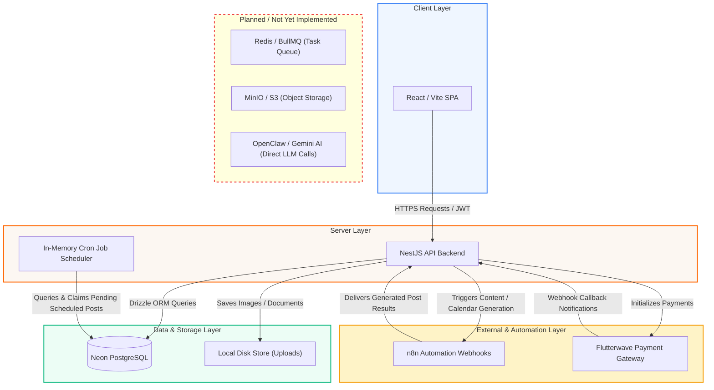

# RaaSocial Onboarding Guide

Welcome to the RaaSocial team! This document contains the essential onboarding guidelines to help you set up and run the codebase.

---

## 1. Project Overview & Target Audience

RaaSocial (featuring Kleos) is an AI-driven social media management platform designed for business owners to schedule posts, manage social channels, and generate tailored content suggestions with minimal manual input. The system manages the entire publishing lifecycle from generation and scheduling to approval gates and automated dispatches.

### User Roles
The platform implements a role-based access control (RBAC) schema dividing users into two main categories:
*   **Customers (`user`):** Business owners who configure channels, view their content calendars, and subscribe to pricing tiers.
*   **Staff / Administrative Roles (`super_admin`, `account_manager`, `reviewer`, `designer`):** Internal administrators who perform Know-Your-Customer (KYC) approvals, manage client accounts, adjust plans, and review AI-generated drafts.

---

## 2. Feature Map & Integration Status

RaaSocial's features are classified below based on whether they are fully database-backed, partially integrated with mocks/webhook callback loops, or not yet implemented.

### 🔑 Authentication & Access Control
*   ✅ **JWT Tokens:** Session creation, Passport authentication strategies, and token refresh routes.
*   ✅ **RBAC Guard Framework:** Dynamic guard cascade (`JwtAuthGuard` ➔ `RolesGuard` ➔ `PermissionsGuard`) enforcing role permission matrix queries.
*   ✅ **Email Verification:** Token-based user activation flow checking for verified status.

### 💳 Subscriptions & Payments
*   ✅ **Tiers & Limits:** Multi-tier configurations restricting user resource count based on plan slugs (`free`, `starter`, `growth`, `enterprise`).
*   ✅ **Flutterwave Checkout:** Secure checkout payload building, links redirect, and plan upgrade mapping.
*   ✅ **Payment Callback webhooks:** Automated subscription activation and state updates triggered by verified transaction event hooks.
*   ✅ **Invoice Logs:** Dynamic generation and archiving of payment invoices inside the database.

### 📱 Social Media Channels
*   ✅ **Stage 1 (CRUD):** Form-based account registration metadata tracking connected profiles (Facebook, Instagram, LinkedIn, X, TikTok, YouTube).
*   🔲 **Stage 2 (OAuth Linkage):** Not Started. Platform accounts write text metadata entries directly; actual OAuth token retrieval flows are stubbed.

### 📅 Content Calendar & AI Suggestions
*   ✅ **Calendar CRUD:** Full interactive dashboard grid allowing users to add, edit, reschedule, or delete post cards.
*   🚧 **AI Suggestions Generation:** Partial. Caption/hashtag generation requests are sent to the `N8N_CONTENT_SUGGESTIONS_WEBHOOK_URL` webhook, but return formatted mock suggestions.
*   🚧 **Bulk Calendar Generation:** Partial. Generation scheduling jobs trigger `N8N_CALENDAR_GENERATION_WEBHOOK_URL` callbacks, awaiting external n8n workflow output.
*   ✅ **Background Scheduling Job:** NestJS database cron job poller scans for due posts every 2 minutes and updates statuses atomically.
*   🔲 **Post Dispatch Engine:** Mocked. `PublishingService.dispatchPost` returns fake publishing logs; social API integrations are not implemented.

### 🛡️ Administrative Panel
*   ✅ **User Stats Tracking:** Relational database counts displaying registered user counts and plans.
*   ✅ **Audit Logging:** System logs mapping administrative panel actions to database audit trails.
*   ✅ **KYC Document Verification:** Admin interface for moderating customer ID uploads.
*   🚧 **Content Moderation Gate:** Partial. Reviews and status flags update correctly in the database, but do not trigger actual API publish requests.
*   🔲 **Audience Analytics & Follower Stats:** Mocked. Dashboard metrics display hardcoded visual mock statistics only.

### ⚙️ System Infrastructure & Services
*   ✅ **Email Sending Fallback:** SMTP and Resend API service layers are fully operational.
*   🔲 **Redis Task Queue (BullMQ):** Configuration values are mapped, but BullMQ queues are not imported or active.
*   🔲 **Object Storage (MinIO):** File uploads write directly to local disk folders instead of S3 buckets.

---

## 3. Tech Stack

*   **Backend:** NestJS (Node.js / TypeScript) + Passport JWT Auth + class-validator
*   **Frontend:** React 18 + Vite + Tailwind CSS + Zustand state + Recharts
*   **Database & ORM:** PostgreSQL (Neon serverless) + Drizzle ORM
*   **Automation:** n8n Webhook pipelines (Content generation and calendars)

---

## 4. Architecture Summary

The repository is structured as an **NPM workspace monorepo** containing a NestJS REST API server (`apps/backend`) and a React Single-Page Application (`apps/frontend`). Data models and relations are defined in Drizzle schemas, and type-safety between backend and frontend is maintained using a shared package (`packages/shared-types`). Background execution currently uses NestJS cron jobs that poll the PostgreSQL database to claim and execute due post schedules.

### Communication Architecture


---

## 5. Local Setup & Running Instructions

Follow these steps to configure your local development environment:

### Step 1: Clone the Repository & Install Dependencies
First, clone the repository and install the NPM workspace packages from the root workspace folder:
```bash
git clone <your-repository-url>
cd Ai.social.manager
npm install
```

### Step 2: Configure Workspace Environment Variables
Copy the templates to create local configuration files:
```bash
# Create Backend .env
cp apps/backend/.env.example apps/backend/.env

# Create Frontend .env
cp apps/frontend/.env.example apps/frontend/.env
```

#### Required Backend Variables (`apps/backend/.env`)
*   `DATABASE_URL`: Connection URL pointing to your PostgreSQL schema.
*   `JWT_ACCESS_SECRET` / `JWT_REFRESH_SECRET`: Base64 or random hex strings used to sign and verify authorization tokens.
*   `SETTINGS_ENCRYPTION_KEY`: A 256-bit symmetric encryption key used by database config wrappers. **Must be exactly 32 characters/bytes.**

#### Optional/Integration Backend Variables
*   `GEMINI_API_KEY`: Key to integrate Gemini LLM. (Optional)
*   `FLUTTERWAVE_SECRET_KEY` / `FLUTTERWAVE_WEBHOOK_SECRET_HASH`: Flutterwave checkout keys. (Optional)
*   `N8N_CALENDAR_GENERATION_WEBHOOK_URL` / `N8N_CONTENT_SUGGESTIONS_WEBHOOK_URL` / `N8N_INTERNAL_API_KEY`: Hook links for n8n automations. (Optional)

#### Required Frontend Variables (`apps/frontend/.env`)
*   `VITE_API_BASE_URL`: Full base endpoint pointing to the NestJS API (Defaults to `http://localhost:4000/api`).

### Step 3: Run Database Migrations
Use Drizzle Kit scripts to update your PostgreSQL schema:
```bash
# Generate SQL migration scripts from schema definitions
npm run db:generate --workspace=apps/backend

# Apply SQL migrations to the target database
npm run db:migrate --workspace=apps/backend
```

### Step 4: Run the Workspaces

#### Concurrently (Both Backend & Frontend)
```bash
# Start both watch scripts concurrently
npm run dev
```

#### Individually
*   **NestJS Backend Server (Port 4000):**
    ```bash
    npm run start:dev --workspace=apps/backend
    ```
    *   **API URL:** `http://localhost:4000/api`
    *   **Interactive Swagger Docs:** `http://localhost:4000/api/docs` (Protected by Basic Auth matching the `SWAGGER_USERNAME` / `SWAGGER_PASSWORD` env vars)
*   **Vite + React Frontend Server (Port 5173):**
    ```bash
    npm run dev --workspace=apps/frontend
    ```
    *   **Customer & Admin Portal:** Open `http://localhost:5173` in your browser.

### Step 5: Test Accounts & Seeding

#### Creating a New Account
No pre-seeded user accounts exist in the database seeding scripts. To log in:
1.  Navigate to `http://localhost:5173/signup` and register a new account.
2.  Since SMTP configuration might be unconfigured locally, you will need to bypass the verification email restriction. Run the helper script to verify all existing registrations directly:
    ```bash
    npx ts-node apps/backend/src/database/update-verified.ts
    ```
3.  Return to the login screen (`http://localhost:5173/login`) and log in with your credentials.

#### Seeding Post Content
To seed the content calendar with simulated posts (scheduled, pending, and approved) for your newly created test account, run:
```bash
npx ts-node apps/backend/src/database/seed-calendar.ts
```
*(This script scans the database and attaches simulated post items directly to the first registered user account.)*

---

## 6. Git Branching Conventions

The team uses developer-name prefixes for personal feature isolation branches alongside standard development branches:
*   **Personal/Feature branches:** Named after developers (`pascal`, `treasure`, `samuel`).
*   **System branches:** `main` (production), `develop` (staging/testing), and context-specific branches (e.g. `refactor/monorepo-migration`, `redesign`).

---

## 7. 'Where Is Everything' Folder Map

### Core Root Directory
*   `apps/backend/` - NestJS API server.
*   `apps/frontend/` - React SPA user and admin client.
*   `packages/shared-types/` - Shared TypeScript interface definitions.
*   `docs/` - Central specifications, styling parameters, and workflow docs.

### Backend Core Modules (`apps/backend/src/`)
*   `auth/` - Handle registration, login, and roles authorization guards.
*   `database/schema/` - Drizzle database table definitions and SQL relations.
*   `payments/` - Flutterwave checkout endpoints and event verification.
*   `scheduling/` - In-memory cron runner checking for and dispatching due posts.
*   `admin/` - Query handlers compiling statistics and reviewing KYC documents.

### Frontend Core Modules (`apps/frontend/src/`)
*   `routes/` - Main React Router definitions nesting layout wrappers.
*   `context/` - AuthContext and AdminAuthContext state mapping.
*   `features/` - API axios connection utilities matching backend segments.
