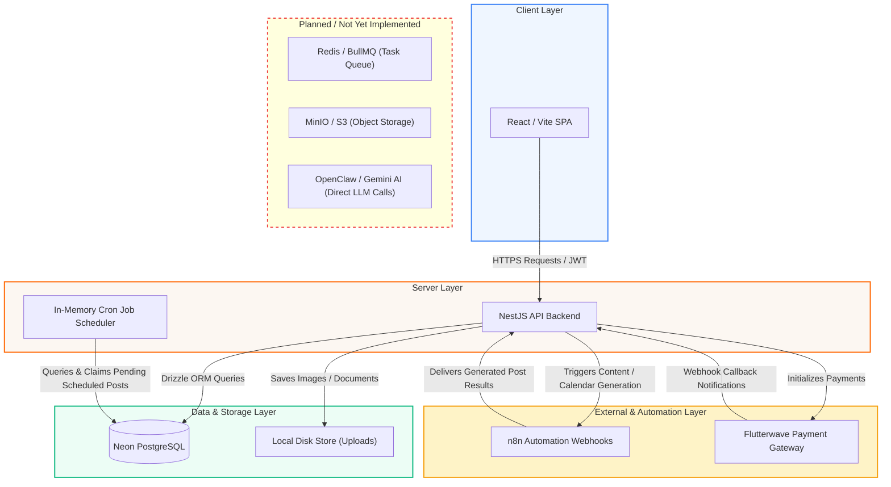

# System Architecture

The following diagram illustrates how the core components of RaaSocial communicate under the current implementation.

## Communication Architecture

---

## Component Roles

### **React/Vite SPA (Frontend)**
Serves as the user interface for both regular customers and administrative staff. It communicates with the backend via Axios HTTP requests, sending JWT authorization headers to fetch analytics, manage brand settings, view the content calendar, and check billing details.

### **NestJS API Backend (Server)**
Coordinates the core business logic, user settings management, authentication guards, role validation, and file uploads. It exposes REST API endpoints, acts as the handler for incoming n8n and Flutterwave webhooks, and serves the interactive Swagger documentation.

### **In-Memory Cron Job Scheduler**
A background polling process executing within the NestJS app context. It scans the database every 2 minutes, identifies scheduled posts that are due for dispatch, and atomically locks them for mock publishing.

### **Neon PostgreSQL (Database)**
Serves as the primary relational database storing user records, subscription tables, content calendar logs, payment status logs, and settings parameters. All data access is modeled and executed through Drizzle ORM.

### **n8n Webhook Automations**
External workflows triggered by the backend to handle asynchronous, long-running processes like bulk calendar post creation and content suggestion variations. Once n8n finishes generating content, it sends the results back to the backend callback endpoints.

### **Flutterwave Payment Gateway**
External billing processor that manages customer checkouts and renewals. It securely validates transactions and updates client plans on the backend via verified webhook callbacks.

### **Local Disk Store (Uploads)**
Serving as a placeholder for S3 object storage, files (like KYC documents and profile photos) are temporarily stored inside local directory paths mapped as static assets by NestJS.
